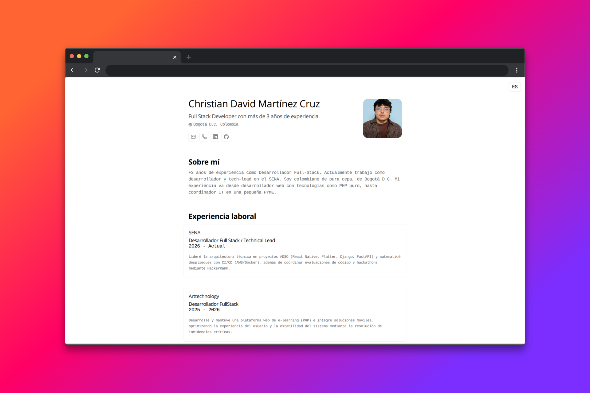

# Minimalist Portfolio — Christian Martínez

> Portfolio y CV web minimalista, adaptado a partir del proyecto original de [midudev](https://github.com/midudev/minimalist-portfolio-json), con información profesional personalizada y funcionalidades adicionales.

<p align="center">
  
</p>

<p align="center">
  <a href="#-descripción">Descripción</a>
  &nbsp;✦&nbsp;
  <a href="#-características">Características</a>
  &nbsp;✦&nbsp;
  <a href="#-stack">Stack</a>
  &nbsp;✦&nbsp;
  <a href="#-ejecución-local">Ejecución</a>
  &nbsp;✦&nbsp;
  <a href="#-licencia">Licencia</a>
</p>

---

## 📋 Descripción

Este proyecto es mi portfolio personal y CV web, construido a partir del proyecto [`minimalist-portfolio-json`](https://github.com/midudev/minimalist-portfolio-json) creado por [midudev](https://github.com/midudev).

La base original proporciona una interfaz minimalista y orientada a la presentación de información profesional, con soporte para visualización web e impresión en formato PDF.

Sobre esta base realicé una adaptación completa de los contenidos para representar mi perfil profesional, experiencia, formación, habilidades y proyectos, además de incorporar funcionalidades adicionales.

### 🌐 Traducción en tiempo real

Una de las principales funcionalidades añadidas es un botón de traducción que permite cambiar dinámicamente el contenido del portfolio entre:

- 🇪🇸 Español
- 🇬🇧 Inglés

La traducción puede realizarse directamente desde la interfaz, permitiendo consultar el portfolio en ambos idiomas sin necesidad de mantener versiones independientes del contenido.

---

## ✨ Características

- 📄 CV y portfolio en formato web.
- 🖨️ Diseño optimizado para impresión y generación de PDF.
- 📱 Diseño responsive para diferentes tamaños de pantalla.
- 🌐 Traducción dinámica entre español e inglés.
- ⚡ Interfaz minimalista y enfocada en la información profesional.
- 🧩 Información estructurada mediante JSON.
- 📚 Secciones para experiencia, formación, habilidades y proyectos.
- ⌨️ Atajos de teclado mediante Ninja Keys.
- 🚀 Construcción y generación de archivos estáticos mediante Astro.

---

## 🛠️ Stack

- [**Astro**](https://astro.build/) — Framework utilizado para construir el sitio web.
- [**TypeScript**](https://www.typescriptlang.org/) — Tipado estático para JavaScript.
- [**Ninja Keys**](https://github.com/ssleptsov/ninja-keys) — Sistema de comandos y atajos de teclado.
- [**JSON Resume Schema**](https://jsonresume.org/schema/) — Estructura utilizada como referencia para organizar la información del CV.

---

## 📁 Estructura del proyecto

La información principal del portfolio se encuentra separada de la estructura visual de la aplicación, siguiendo el enfoque del proyecto original.

```text
.
├── public/
│   ├── locales/
│   └── assets/
├── src/
│   ├── components/
│   ├── layouts/
│   ├── pages/
│   └── ...
├── astro.config.*
├── package.json
└── README.md
```

La información profesional puede modificarse principalmente desde `cv.json`, manteniendo separada la información del contenido de la implementación de la interfaz.

---

## 🚀 Ejecución local

### 1. Clonar el repositorio

```bash
git clone <URL-DE-TU-REPOSITORIO>
cd <NOMBRE-DEL-REPOSITORIO>
```

### 2. Instalar las dependencias

Este proyecto utiliza `pnpm` como gestor de paquetes.

```bash
pnpm install
```

### 3. Iniciar el servidor de desarrollo

```bash
pnpm dev
```

El proyecto estará disponible normalmente en:

```text
http://localhost:4321
```

### 4. Generar la versión de producción

```bash
pnpm build
```

Los archivos generados estarán disponibles en:

```text
./dist/
```

### 5. Previsualizar la versión de producción

```bash
pnpm preview
```

---

## 🧞 Comandos

| Comando | Acción |
| :--- | :--- |
| `pnpm install` | Instala las dependencias del proyecto. |
| `pnpm dev` | Inicia el servidor de desarrollo local. |
| `pnpm build` | Comprueba el proyecto y genera la versión de producción. |
| `pnpm preview` | Ejecuta una vista previa de la versión de producción. |

---

## 🎨 Créditos y origen

Este proyecto utiliza como base el diseño y estructura del proyecto:

**[midudev/minimalist-portfolio-json](https://github.com/midudev/minimalist-portfolio-json)**

El proyecto original fue creado por [midudev](https://midu.dev) y está basado en el diseño de [Bartosz Jarocki](https://github.com/BartoszJarocki/cv).

Mi trabajo sobre esta base se centra principalmente en:

- Adaptación completa del contenido al perfil profesional.
- Personalización de la información del CV.
- Modificación y ajuste de la interfaz.
- Incorporación de la funcionalidad de traducción español ↔ inglés.
- Integración de la experiencia profesional, formación, habilidades y proyectos personales.

---

## 🔑 Licencia

El proyecto original se distribuye bajo la licencia [MIT](LICENSE.txt).

Esta adaptación mantiene el reconocimiento correspondiente al proyecto y diseño originales.

---

<p align="center">
  <sub>
    Portfolio personal basado en
    <a href="https://github.com/midudev/minimalist-portfolio-json">
      minimalist-portfolio-json
    </a>
  </sub>
</p>